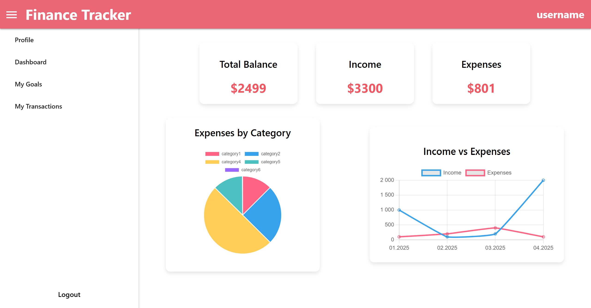
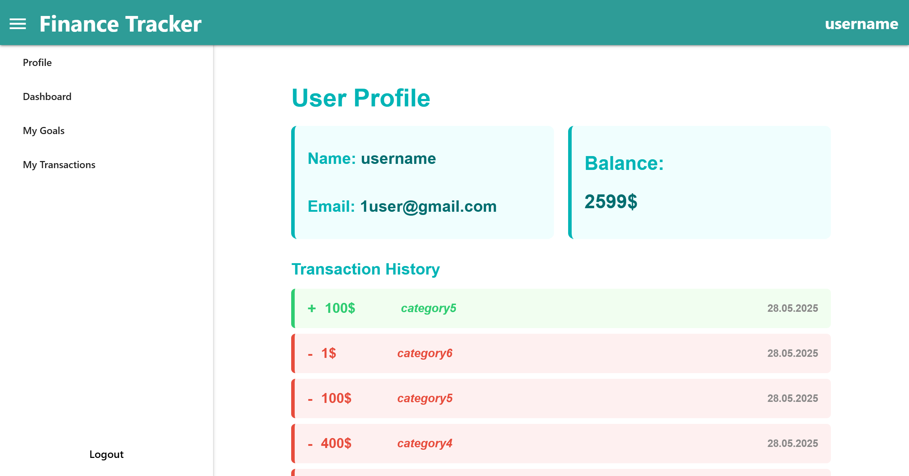
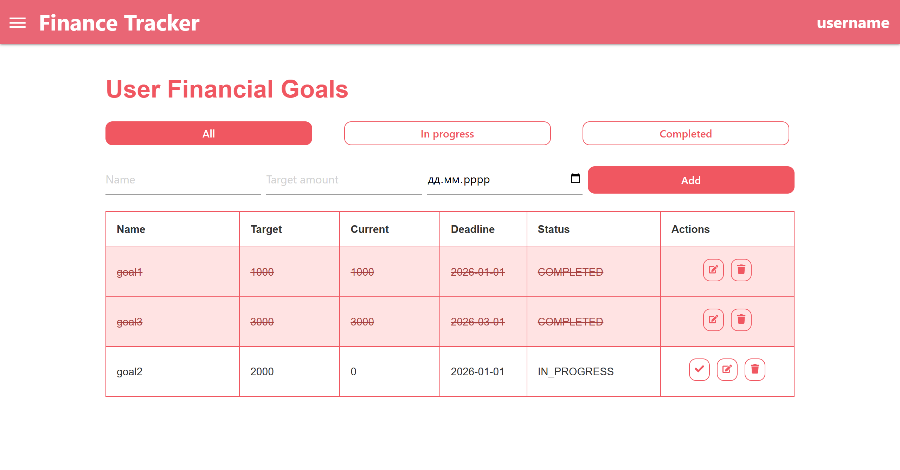
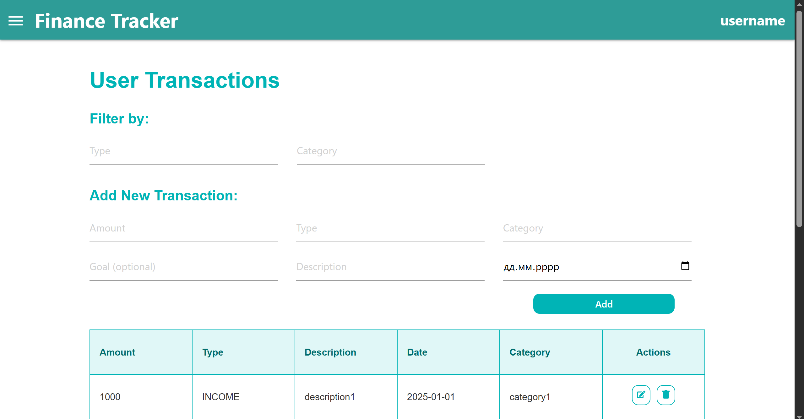

# Personal Finance Tracker System

Personal Finance Tracker System is a web application designed to help users track their income, expenses, and financial goals. The system follows a microservices architecture and leverages asynchronous messaging for real-time updates.

## Technologies

- Java & Spring Boot for backend development
- Spring Data JPA & Hibernate for ORM
- PostgreSQL for data storage
- RabbitMQ for asynchronous event handling
- Spring Cloud Gateway as API Gateway
- React for frontend UI
- JavaScript for client-side logic
- REST APIs for communication between frontend and backend

## Features

 **Microservices Architecture**  
The application is split into multiple services for modular development and scalability:
- **User Service**: Handles registration, authentication, and user data.
- **Transaction Service**: Manages financial transactions.
- **Goal Service**: Manages financial goals and listens to transaction events for progress updates.

**API Gateway**  
A centralized API Gateway manages routing of requests to backend services and handles tasks such as authentication, logging, and load balancing.

**Message Broker Integration**  
RabbitMQ facilitates asynchronous communication. When transactions are created, related goal data is updated via message events.

**Database Integration**  
Each service uses PostgreSQL for persistent and reliable data storage.

**RESTful APIs**  
All services provide REST APIs to enable integration with the frontend through the API Gateway.

**Frontend Dashboard**  
An intuitive React-based interface for users to interact with financial data, view statistics, and manage transactions and goals.

## Pages

**Dashboard Page**  
Provides visual financial insights using:
- Pie charts for expense distribution by category
- Line charts showing income and expense trends over time

**Analytics Page**  
Shows an overview of the user's finances, including current balance, recent transactions.

**Goals Page**  
Allows users to manage financial goals, view progress, and edit or create new goals. Goal progress is automatically updated based on related transactions.

**Transactions Page**  
Lists all income and expense transactions with options to filter, sort, add, edit, and delete entries.

